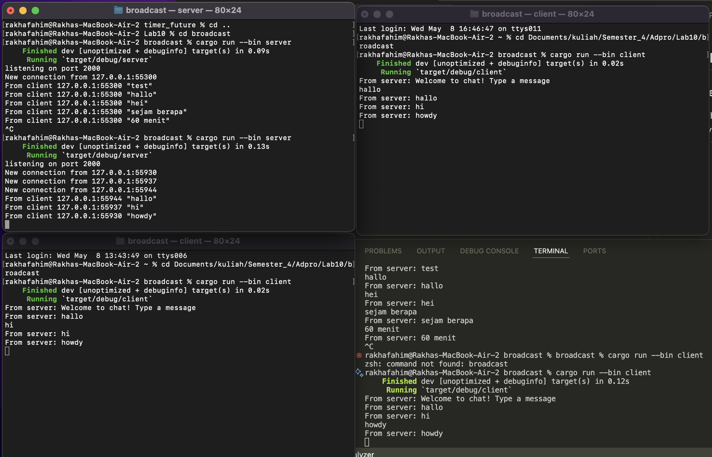

## Reflection

### Experiment 2.1: Original code, and how it run

every time a client send a message the server will send that message every client that are connected to the server.

### Experiment 2.2: Modifying port
In server.rs, changes need to be made in the main function, and similar adjustments are necessary for client.rs. Both applications must use the same port to ensure proper connectivity between the client and the server. Additionally, it has been noted that the server uses the TCP protocol, while the client employs WebSocket. This discrepancy in protocols needs to be addressed.